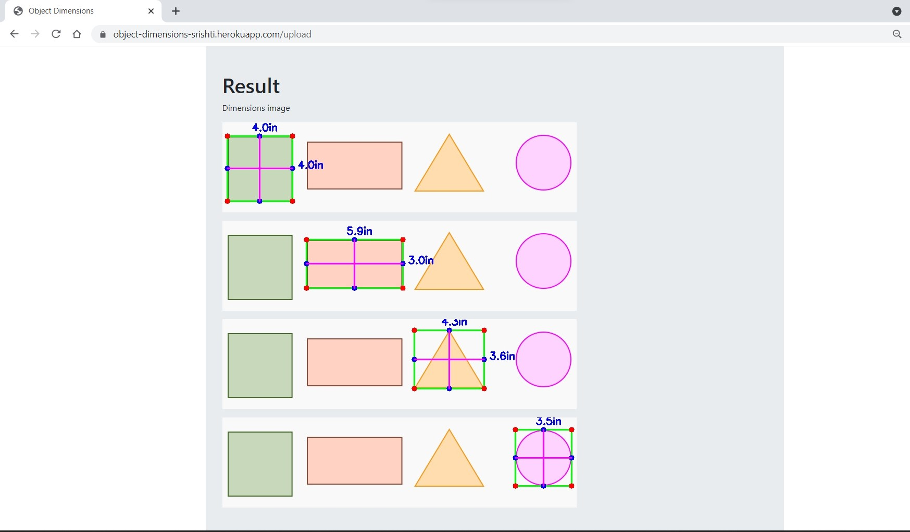

# UCS757:Building Innovative Systems
# Project 1:Object Dimension Measurement
## Introduction
This project calculates the size of objects based on a given reference object.It estimates size using OpenCV and Python.
## Requirements
1. Python
2. NumPy
3. OpenCV
4. imutils
## Live Link
## Input Interface
## Input

## Output

## Flowchart

## Limitation
This technique requires the image to be near perfect top-down view of the objects to calculate the accurate results. Otherwise the dimensions of the objects in the image may be distorted.
## Submitted by:-
### Srishti Mittal
### 101803157
### COE 8